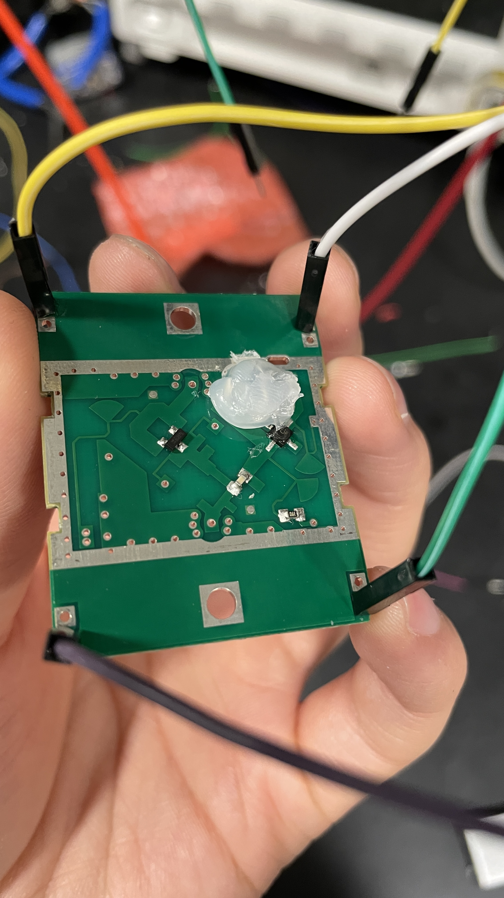
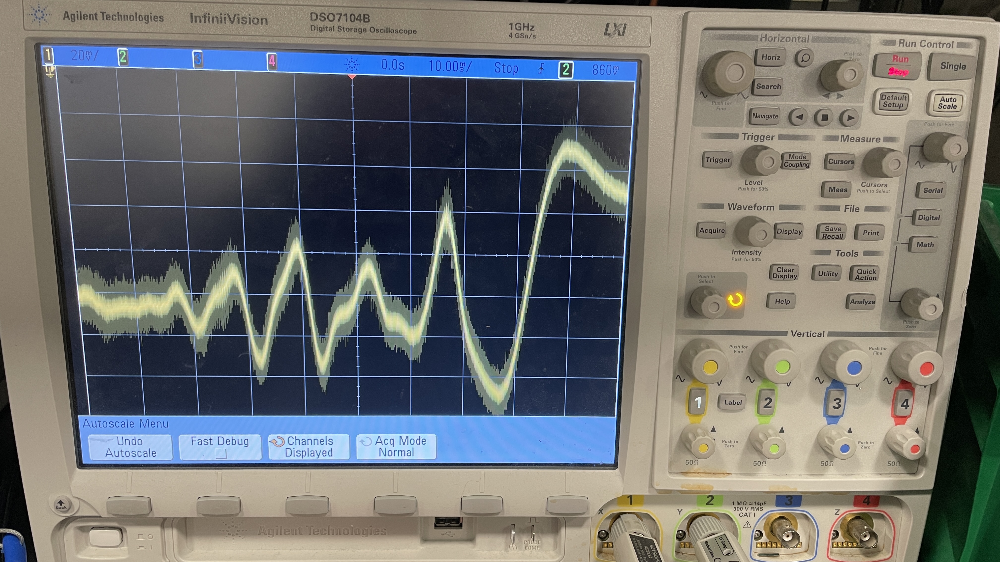
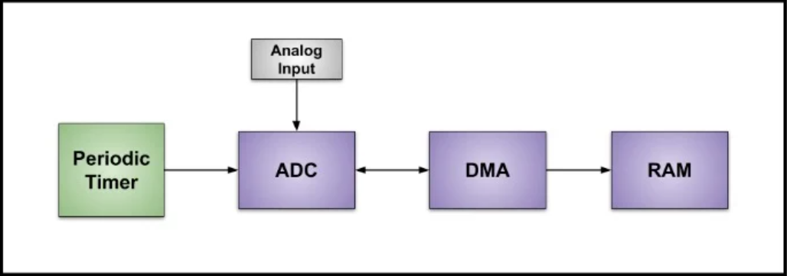
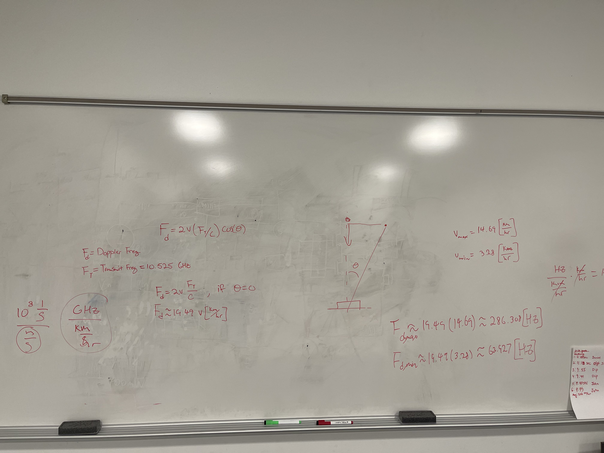

# 2/7/2023 - First Meeting with TA
Met with TA and explained our project. He also gave some logistical information and our lockers.

# 2/10/2023 - Testing Doppler and Ultrasonic Modules
Received our modules however the doppler module came damaged. We managed to hot glue the ceramic oscillator back on but still not sure if permanently damaged, probably have to order another one.

Went into the lab and hooked up both to an oscilloscope and tried to see the output signal out of both modules.

For the doppler module the signal as expected seemed really weak and noisy which indicates it requires an LNA. Testing the functionality, when walking towards the module head on at around a meter out a very weak beat signal is noticable. When sprinting towards the module head on at around a meter out a clear distinctive beat signal is produced.

When trying to hook up the ultrasonic sensor we were not able to trigger the module even with a 10 microsecond square wave. For next time maybe using an arduino or some sort of microcontroller would be a better option then a signal generator.

# 2/12/2023 - Researching the Microcontroller
Learned a bit about the STM32 series of microcontrollers and how the timer works in most microcontrollers. We probably want to do a interrupt based system since polling the timer can take up a lot of resources from the processor. So the main program runs continously until a timer runs down and it triggers a interupt which shifts the control of the program from main to ISR (interupt service routine). The ISR is where we can do our calculations while the main program fills a buffer with our doppler and ultrasonic samples.

Additionally we can make use of a periodic timer to accurately sample our doppler and ultrasonic modules at a fixed frequency. 

# 2/20/2023 - Doppler Frequencies
We first laid out a mathematical calculation in order to see what the theoretical frequencies that we would expect to see for the average speeds that we would expect people to walk/run at. 

We calculated the averages speeds by doing multiple experiments where we walked/ran 10 yards and measured the time that it took. From that we could easily calculate the speeds with which we averaged into a final number which we used in our doppler frequency calculations.

After we got our theoretical max and minimum doppler frequencies we tested them out by hooking them up the doppler to a oscilloscope and measuring the frequency outputted by the doppler module when running and walking towards it.

# 2/22/2023 - Ultrasonic Sensor
We were able to get the ultrasonic sensor working with the STM32F303K8 microcontroller. By using an interrupt
based system we could efficently send out and receive the Trigger and Echo signals that are used to interface with the sensor. From the time of flight data we can turn that information into a distance by using a simple equation.

Distance = (T * 343/2)

The 343 comes from the speed of sound while the factor of 1/2 comes from the fact that the time of flight comprises of both the forward and back paths. 

For hooking the ultrasonic up to the microcontroller we had to implement a simple voltage divider with a 1 kOhm and 2 kOhm resistors which allowed us to level shift the 5 Volt Echo line to 3.3 Volts for safer input to the timer input pin on the microcontroller.
